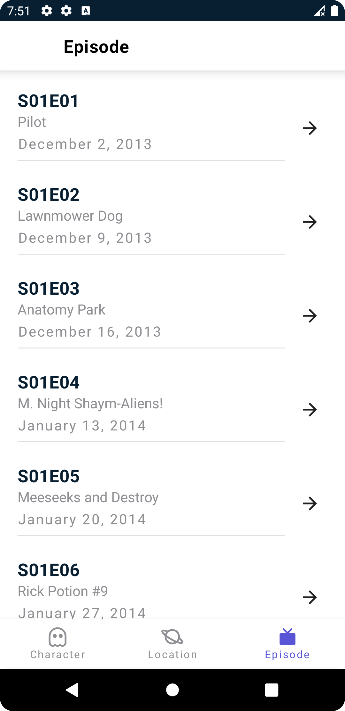

# Rick And Morty Compose Version
Rick and Morty demonstrates modern Android development with Hilt, Coroutines, Flow on MVVM architecture.

## App Screens

| Character Vertical Screen                                          | Character Horizantol Screen |
| :----:                                                             |    :----:                   |         
| |  |
| Character Vertical Screen - ListType                               | Character Horizantol Screen  ListType |
| |  |
| Location Vertical Screen                              | Location Horizantol Screen  ListType |
| |  |
| Episode Vertical Screen                              | Episode Horizantol Screen  ListType |
| |  |

  
## Projects Features

- [Compose](https://developer.android.com/jetpack/compose) Define your UI programmatically with composable functions that describe its shape and data dependencies.
- Kotlin based [Coroutines](https://github.com/Kotlin/kotlinx.coroutines) + Flow for asynchronous.
- MVVM (Model, View, ViewModel)
- [Room](https://developer.android.com/training/data-storage/room) -Create, store, and manage persistent data backed by a SQLite database.
- [Hilt](https://developer.android.com/training/dependency-injection/hilt-android) - Hilt is a dependency injection library for Android that reduces the boilerplate of doing manual dependency injection in your project
- [Paging](https://developer.android.com/topic/libraries/architecture/paging/v3-overview) - The Paging library makes it easier for you to load data incrementally and gracefully within your app's UI
- [Navigation](https://developer.android.com/guide/navigation) 
- [Retrofit](https://github.com/square/retrofit) - A type-safe HTTP client for Android and Java. 
- [Moshi](https://github.com/square/moshi) - A modern JSON library for Android, Java and Kotlin
- [Coil](https://github.com/coil-kt/coil) - An image loading library for Android backed by Kotlin Coroutines.
- [Lottie in Compose](https://github.com/airbnb/lottie/blob/master/android-compose.md) -A Lottie is a JSON-based animation file format that enables designers to ship animations on any platform as easily as shipping static assets. 

## Open API

Rick And Morty using [Rick And Mory API](https://rickandmortyapi.com/)

## Find this repository useful? 
Don't forget give a star. ⭐

  
